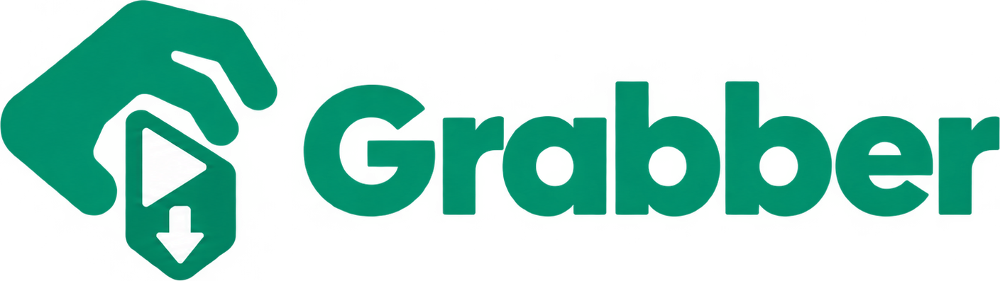

<p align="center">
  
</p>

<p align="center">
  <b>Grab any video on the page. Watch it offline.</b><br />
  Chrome extension (Manifest V3) that detects videos on the current page and downloads them locally.
</p>

<p align="center">
  
  
  
  
</p>

## Features

- Captures `.m3u8` (HLS) and `.mp4` requests per tab, including inside iframes
- Parses HLS master/media playlists, lets you pick the quality
- Downloads segments in parallel and decrypts AES-128 (no DRM support)
- Saves MP4 by default (TS → MP4 remux in the browser via mux.js, no re-encode) or raw TS
- YouTube and 1000+ other sites via a local [yt-dlp](https://github.com/yt-dlp/yt-dlp) bridge (Native Messaging)

## Install (release)

1. Download `grabber-<version>-chrome.zip` from [Releases](https://github.com/Duduenri/Grabber/releases/latest) and unzip it to a folder you will keep
2. Open `chrome://extensions`, enable **Developer mode**, click **Load unpacked** and pick that folder
3. Optional, for YouTube: download `grabber-native-host-<version>.zip`, unzip it somewhere permanent and run `bash install.sh` (see [YouTube / yt-dlp](#youtube--yt-dlp-optional) for requirements)

## Setup (from source)

```bash
npm install
npm run build          # Chrome  → .output/chrome-mv3
npm run build:firefox  # Firefox → .output/firefox-mv3
```

**Chrome / Chromium / Brave:** open `chrome://extensions`, enable Developer mode, click **Load unpacked** and select `.output/chrome-mv3`.

**Firefox (140+):** open `about:debugging#/runtime/this-firefox`, click **Load Temporary Add-on…** and pick `.output/firefox-mv3/manifest.json` (temporary add-ons are removed when Firefox closes; for a permanent install, use the signed `.xpi`).

Browser differences:

| | Chrome | Firefox |
|---|---|---|
| Extension ID | `cmjilacbcoijmjemgcjpmbndepbibjje` (manifest `key`) | `grabber@duduenri` |
| Player opens yt-dlp files from disk | yes, after enabling *Allow access to file URLs* | no (browser restriction) — drag the file in |
| Native host manifest | `~/.config/<browser>/NativeMessagingHosts/` | `~/.mozilla/native-messaging-hosts/` |

### YouTube / yt-dlp (optional)

YouTube does not serve plain HLS/MP4 (it uses its own streaming protocol with signed, rotating URLs), so Grabber delegates it to yt-dlp running on your machine.

1. Install yt-dlp (use the official binary — distro packages are usually too old for YouTube):

   ```bash
   curl -L https://github.com/yt-dlp/yt-dlp/releases/latest/download/yt-dlp -o ~/.local/bin/yt-dlp
   chmod +x ~/.local/bin/yt-dlp
   ```

2. Install ffmpeg (merges audio + video): `sudo apt install ffmpeg`
3. Register the native host for Chrome/Chromium/Brave/Firefox:

   ```bash
   ./native-host/install.sh
   ```

   Run it again if you move the project folder. It pins your current `PATH` so Chrome can find `yt-dlp`, `ffmpeg` and `node`/`deno` (yt-dlp needs a JS runtime for YouTube).

The extension ID is pinned via `key` in `wxt.config.ts` (`cmjilacbcoijmjemgcjpmbndepbibjje`), which is what the host manifest allows.

Files are saved to `~/Downloads`. Keep yt-dlp updated: `yt-dlp -U`.

Without the host, you can run it manually:

```bash
yt-dlp -S "vcodec:h264,res:1080,acodec:m4a" --merge-output-format mp4 "https://www.youtube.com/watch?v=..."
```

## Usage

**HLS / MP4 pages (e.g. course platforms)**

1. Open the page with the video and reload it (the playlist is only requested on load)
2. Click the Grabber icon and hit **Baixar** on the HLS entry
3. Choose quality and format (MP4 recommended) and download

**YouTube and other sites supported by yt-dlp**

1. Open the video page and click the Grabber icon
2. Hit **yt-dlp**, pick a preset and download — keep the tab open until it finishes

| Preset | Output |
|---|---|
| MP4 até 1080p | H.264 + AAC, plays everywhere |
| MP4 até 720p | smaller file |
| Melhor qualidade | best available (may be 4K VP9/AV1), MKV |
| Só áudio | M4A |

**Player (offline)**

Popup → **▶ Player**, then pick or drag videos from `~/Downloads`. Plays MP4/WebM (and MKV with H.264) right in Chrome, no system player needed. Remembers where you stopped in each file, auto-plays the next one (files sorted by name) and has 1x–2x speed buttons.

DRM-protected streams (Widevine: Netflix, Prime, etc.) are not supported.

## Scripts

- `npm run build` / `npm run build:firefox` — production build
- `npm run zip` / `npm run zip:firefox` — store-ready zip (Firefox also gets a sources zip for AMO review)
- `npm run compile` — type check

## Project layout

| Path | Role |
|---|---|
| `entrypoints/background.ts` | captures `.m3u8`/`.mp4` requests per tab |
| `entrypoints/popup/` | lists captures + yt-dlp shortcut |
| `entrypoints/downloader/` | HLS download, AES-128 decrypt, MP4 remux |
| `entrypoints/ytdlp/` | talks to the native host, shows progress |
| `entrypoints/player/` | offline player with resume and speed control |
| `lib/hls.ts` | HLS playlist parser |
| `lib/transmux.ts` | TS → MP4 via mux.js |
| `native-host/` | Python yt-dlp bridge + installer |

## Brand

| Asset | File |
|---|---|
| Symbol | `assets/brand/logo.png` |
| Wordmark | `assets/brand/wordmark.png` |
| Extension icons | `public/icon/{16,32,48,128}.png` |
| Brand green | `#029975` |

---

Licensed under [MIT](LICENSE).

<p align="center">
  <br />
  Desenvolvido por <a href="https://www.linkedin.com/in/duduenri">Eduardo Enrique</a>
</p>
